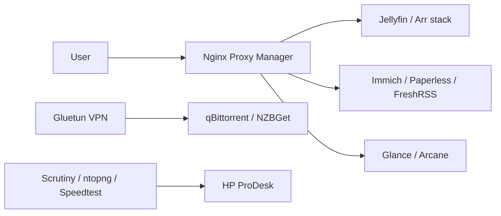

# Architecture overview

```mermaid
flowchart LR
    User[User] --> NPM[Nginx Proxy Manager]
    NPM --> Media[Jellyfin / Arr stack]
    NPM --> Apps[Immich / Paperless / FreshRSS]
    NPM --> Dash[Glance / Arcane]

    VPN[Gluetun VPN] --> Torrents[qBittorrent / NZBGet]
    Monitor[Scrutiny / ntopng / Speedtest] --> Host[HP ProDesk]
```