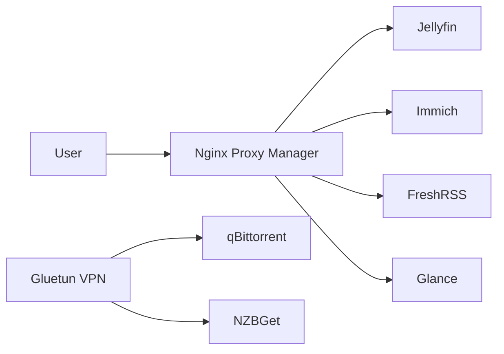

# Architecture overview

## Design goals
- Keep services containerized and easy to recreate.
- Route public access through a single reverse proxy.
- Send torrent and usenet traffic through the VPN gateway.
- Store stack snapshots and notes in source control for portability.
